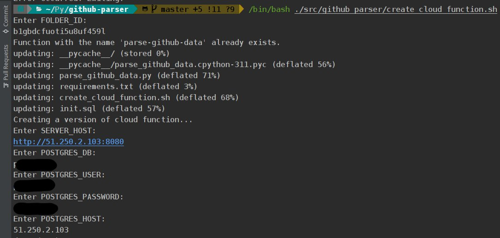
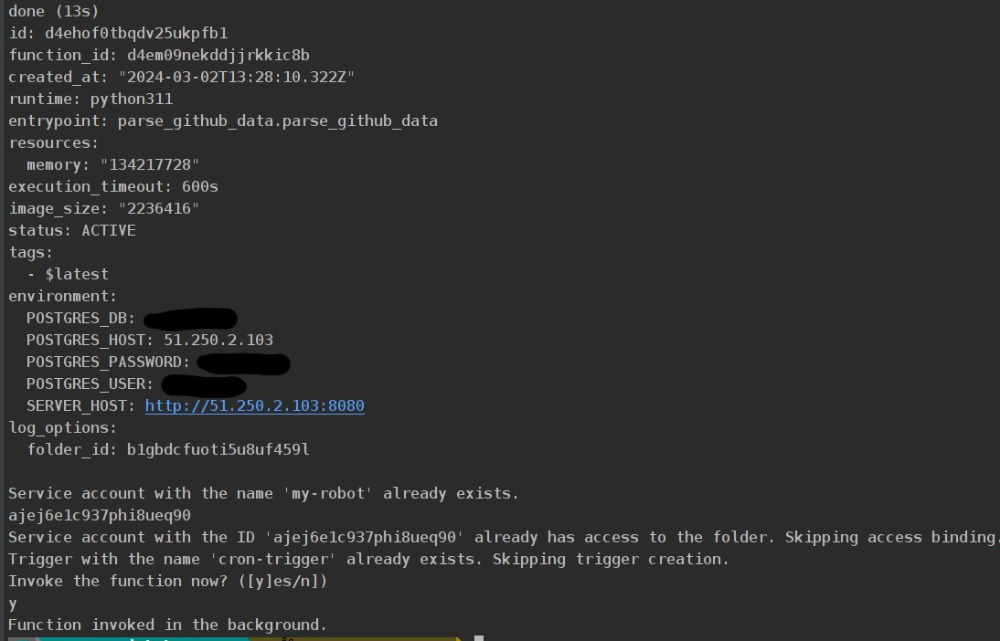

# GitHub Parser

Data parser from GitHub

## Installation and Setup

1. Install Docker and Docker Compose if they are not already installed on your system.

2. Clone the project repository:

```bash
git clone https://github.com/Djama1GIT/github-parser.git
cd github-parser
```

3. Start the project:

```bash
docker-compose up --build
```

## User Interface

After starting the project, you can access the Swagger user interface at: http://localhost:7354/docs.<br>
In Swagger, you can view the available endpoints and their parameters, and also make requests to the API.

## A few tests

```bash
pytest .
```

## Creating and invoke a cloud function

The function runs every half hour. 
I deemed it necessary to do so because it's not a very short or very long period, 
as there won't be too many changes during this time, and the number of API requests will be moderate.

```bash
/bin/bash ./src/github_parser/create_cloud_function.sh
```

Example:



